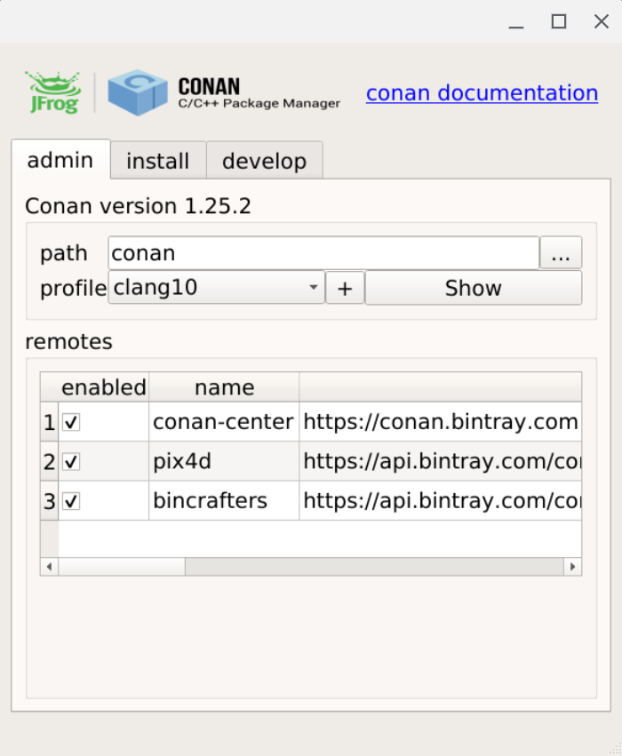
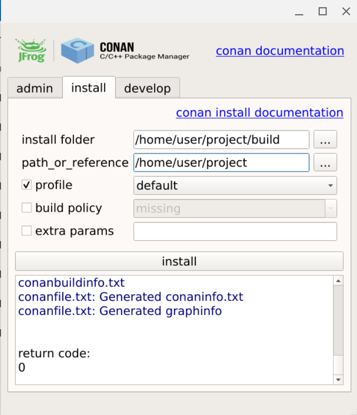
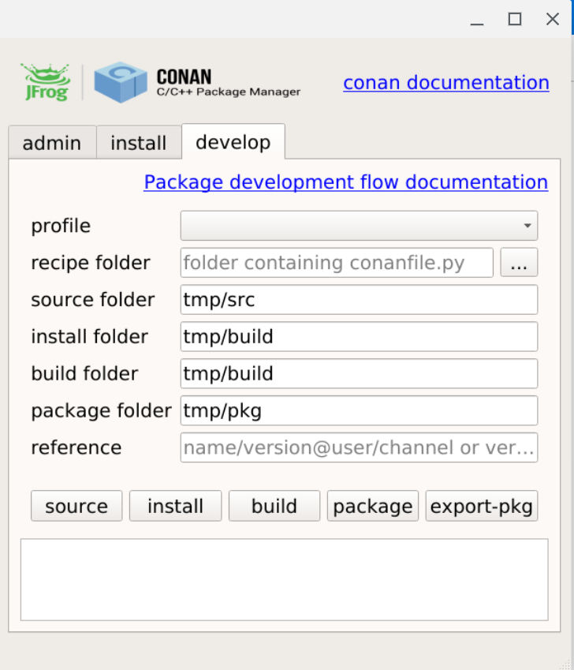

# Conan GUI

conan-gui is a desktop application to interact with conan.io package manager

## Screenshots

  

## Features

### administration view

- [x] direct access to 'conan' documentation 
- [x] pick conan executable on path or selectable by user
- [x] display conan version
- [x] display available profiles
- [x] open profile with text editor
- [x] open profile with text editor
- [x] display remotes
- [x] can enable/disable remote

- [ ] remember selected conan executable

### install view
 
 helper to execute conan install command

- [x] direct access to 'conan install' documentation 
- [x] need to select install folder and build folder
- [x] can select profile
- [x] can select one build policy (missing, all, cascade, pattern)
- [x] can add extra parameters
- [x] display executed command line
- [x] display standard output and standard error
- [x] display return code

 ### develop view

helper to the package development flow

- [x] direct access to 'conan package development flow' documentation 
- [ ] select profile
- [ ] select recipe folder
- [ ] define development folders (source folder, install folder, build folder and package folder)
- [ ] one button for each step (source, install, build, package, export-pkg)
- [ ] display executed command line
- [ ] display standard output and standard error
- [ ] display return code

